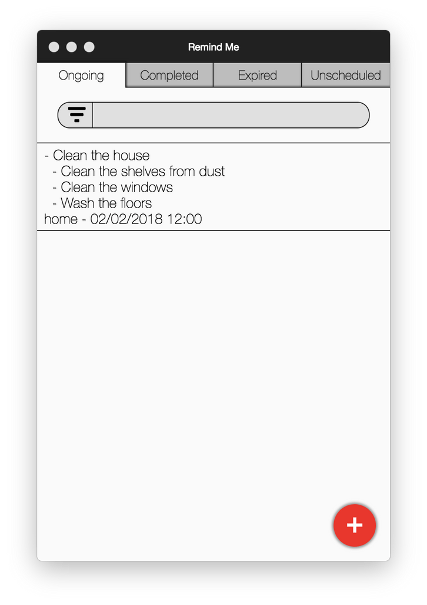

# Remind Me

Remind me is a cross-platform remidner tracker that currently supports macOS, Windows, and Linux.

## Installation

Installing the program is just as easy as following the installer instructions. Take a note that during the first start the app will create its configuration files in your home folder. Those can be found in the application directory which is `$HOME/Library/Application Support/remind-me` folder on macOS, `%APPDATA%/remind-me` folder on Windows, and `$HOME/.remind-me` folder on Linux. Thus, if you decide tocompletely uninstall the program, make sure you delete the application directory as well.

## Configuration files

If the app was launched at least once, files `colors.json` and `reminders.json` will be created in the application directory.

File `colors.json` is a JSON-formatted file that represents a dictionary in whcih reminder tags serve as keys and corresponding badge colors as values. Keys should always be lowercase and color values should be represented as valid CSS color values, e.g. as hex values including the preceding hash sign.

File `reminders.json` is a JSON-formatted file that contains user-created reminders as an array of objects. Each object represents a reminder with the following properties:

* `task` - The main task of the reminder
* `completed` - Status of the reminder. Equals `true` if the corresponding task was completed.
* `scheduled` - Type of the reminder. Equals `true` is the reminder is scheduled due to a certain moment of time.
* `date` - Date and time due to which the reminder was scheduled. If the reminder is scheduled, the property mush be present. Otherwise, it can be missing.
* `tag` - Reminder tag. Tags are used to filter reminders.
* `subtasks` - Array of subtasks for the current task. Subtasks are objects that should have the following structure:
  - `content` - Content of the subtask.
  - `completed` - Status of the subtask. Equals `true` if the corresponding task was completed.

## Interface

All the reminders are split into four groups depending on their type. These are "ongoing", "completed", "expired", and "unscheduled". Groups can be accessed by opening corresponding tabs.

Underneath the tab bar there is a filter bar and reminders of the opened group. The filter bar can be used to filter notes by tag.

By clicking on a reminder twice one put it into the edit mode. In edit mode the reminder is represented as text with the following structure:

* The first line represents the main task.
* The last line represents reminder attributes
* The lines in-between represent subtasks.

Every task line should start with a plus or minus sign, depending on whether a task/subtask is completed or not, and followed by the task content.

The last line should contain the reminder tag and optionally the scheduled time in format `mm/dd/yy hh:mm`. If the time is not specified, the reminder will have a type of unscheduled.

When editing new lines can be created by pressing `Shift + Enter`. In order to finish editing a reminder either double click on it or press `Enter`. Empty notes are deleted.

In order to create a new note, press the floating action button in the bottom-right corner of the screen. This will create a new reminder and put it into the editing mode.

*__Note:__* Make sure you always exit editing mode before closing the app or changing a tab. Otherwise, the note might get lost.

## Bugs

If you encounter a bug, please report it at https://github.com/paper-lark/remind-me/issues.

## License

Remind Me is available under terms of MIT license. See `LICENSE` for details.
